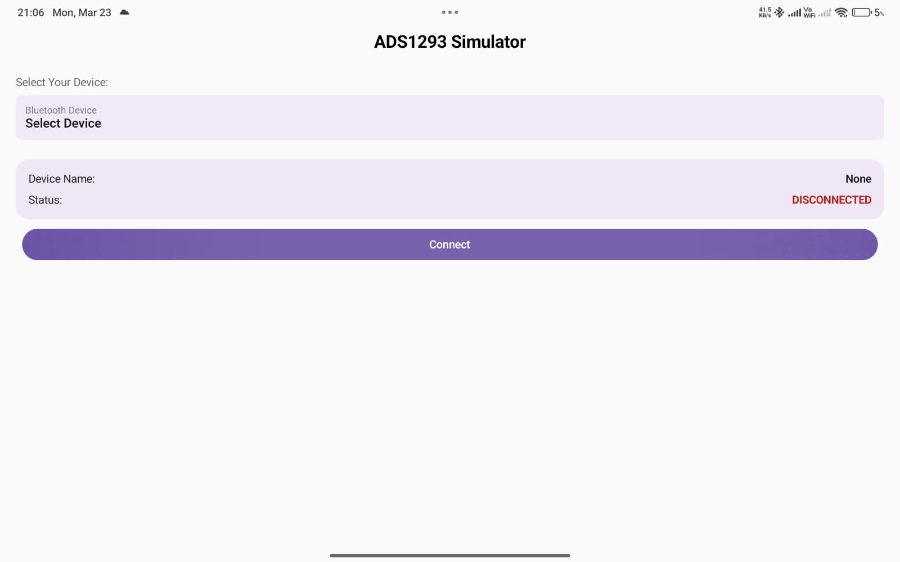
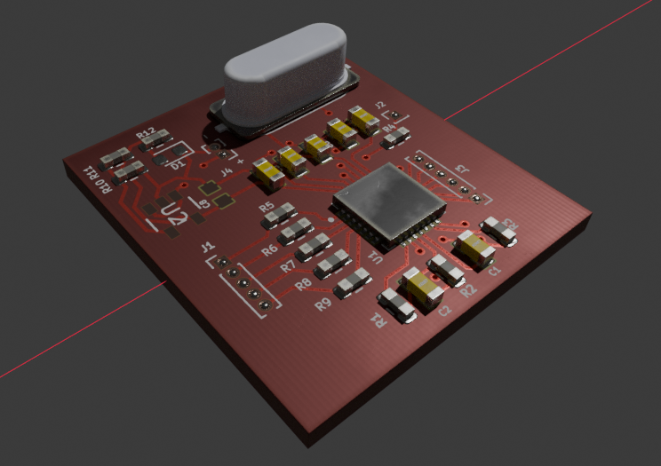
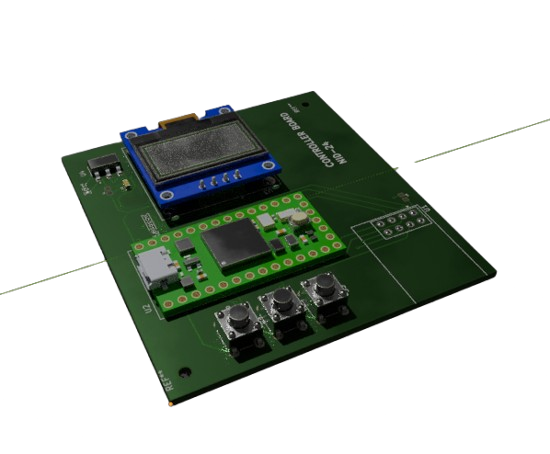
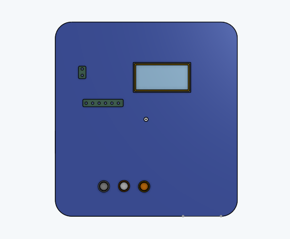

# NID-24

NID-24 is a EMG based Humand Device Interface system that allows users to experience unique ways to interact with computers.

This project allows users to use their hand as mouse. Based on ADS1293 and state-of-the-art software architecture, it continously classifies intent and executes it via bluetooth.

## Why I am building NID-24 ?
Biotech is super awesome, it sits at the intersection of biology and technology. Most of my projects that I made are inspired by sci-fi movies. So, this one is special one from Iron Man 3.

Also, I have some experience in working with EEG, however, I don't have access to a specialised lab, I am building this surface EMG (sEMG) system.

**The second phase of this project will involve finding relevant techniques for making robust EMG system which will can tolerate muscle fatigue and deliver similar performance.**

## Features

 - Analysis Software - Watch and Record Signals In Real Time.

  - ADS1293 Simulator Android App - Don't have the hardware ? Don't worry we have an android app to simulate the hardware readings.

  - Controller Board - Consists of the main MCU Teensy 4.0 for on-board processing, 3 push buttons for menu control, a bluetooth module for data transfer and an OLED 0.96 Inch display

  - ADS1293 based Board - ADS1293 the heart of this project sits at the center of this PCB allowing easy interfacing of chip with the system.

## Directory Structure
- nsys - Analysis Software
- controller_board - The Controller Board
- ads1293_board - The ADS1293 based board
- SignalsSimulator - The Android App (It has it's own readme. Follow instructions to use and install)

## Analysis Software 

 <!-- Replace this image -->

The Analysis Software allows developers to study the signals to gather information about the signal.

This software visualises all the information from ADS1293.

The features are as follows:
 - 3 Channel EMG (50 ms visual update rate)
 - Latency Meter
 - Data Recorder

## ADS1293 Simulator
Don't worry if you don't have your hardware yet. Just download this app and it will act like our ADS1293 based board.

Currently, it is orientated in Landscape mode, works with potrait too.

This will act like ADS1293 and send data to our computer/analysis software for analysis.

**After using/disconnecting this app. Please make sure to clear it from the background also to avoid residual**

## ADS1293 Based Board (THE HEART)

| Render | PCB |
|--------|--------|
|  |  |

### Features:
 - 24-bit resolution
 - Reduced EMI
 - Saperated analog and digital traces
 - Meets SIMEAN safety standards

This board acquires raw signals from the muscle fibers, the in-built amplifier amplifies the signals and converts AC values to DC values that an be understood by our machines.

We read this data and draw our conclusions

## Controller Board

| Render | PCB |
|--------|--------|
|  | |

Using simulator is easy you can connect to your PC via system ui bluetooth but we don't have any way to connect out Teensy 4.0 to our PC. So, this PCB has 3 push buttons, 
Teensy 4.0, OLED 0.96 Display and a bluetooth module for data transfer.

Controller Board case Onshape [link here.](https://cad.onshape.com/documents/cf77a823cf461f5b911517e3/w/527c1a40b344ced2cb5cf64d/e/4507412c1ac5528a6c833cb1?renderMode=0&uiState=69ee44c7155ef2a92238ec7a)

Features of Case:

1. Smooth curves / No sharp edges
2. No screws required
3. Proper spacing for NRF24L01 module and USB for debugging

## BOM
Please refer to [BOM.csv](https://github.com/Raghav67816/NID-24/blob/26a6b678d887043cc9d59b595e46c1396d229c52/BOM%20Final.csv)

## How To Use ?

Step 1: Order all the parts.

Step 2: Get the PCBs printed.

Step 3: Assemble by yourself or get it assembled by PCB manufacturer using the schematics.

Step 4: (Important) Before plugging the ADS1293 into the board check all the input passives.
No input passives should exceed the limits provided by Texas Instruments in their documentation.

Step 5: Load the firmwares for both boards

Step 6: Connect both boads via breakout pins on the ADS1293 Breakout board

Step 7: Connect to the Analysis software via bluetooth using Controller Board

Step 8: Enjoy

**Note: This project involves RLD i.e small amount of current is injected in your body to counter noise. Since, this project is still under development. DO NOT USE THE RLD ELECTRODE UNTIL DEVELOPMENT STATUS IS UPDATED IN THE README**

However, you can try the Signals Simulator App to simulate the ADS1293 Breakout Board.
