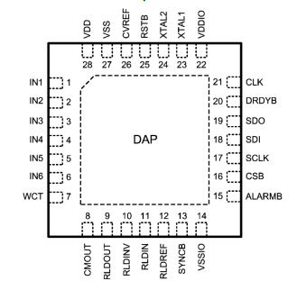
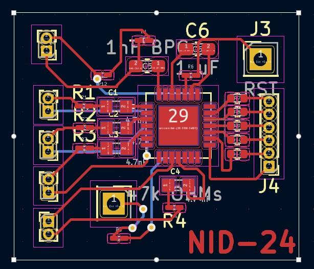

## About ADS1293

It is a low-power, 3-channel, 24 bit analog front end for biopotential measurements.
This AFE is the heart of NID-24 as signal acquition and filtering is the very first
important stage in every biomedical device.

Clean signals i.e less noise results in higher quality of outcomes.

!!! warning
	This design is under-development.
