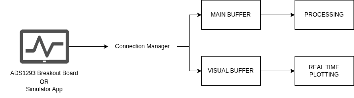

The data enters into the application from this point. Data reader manages two internal ring buffers **visualisation buffer** and **main buffer**. The main buffer holds **1000** values while visualisation buffer holds **100** data packets.

The visualisation buffer is derived from the main buffer. The buffer holds latest values from the main buffer.

The main buffer is not modified at any stage of processing, each component of the application process it in it's own way without modifying the original buffer.

