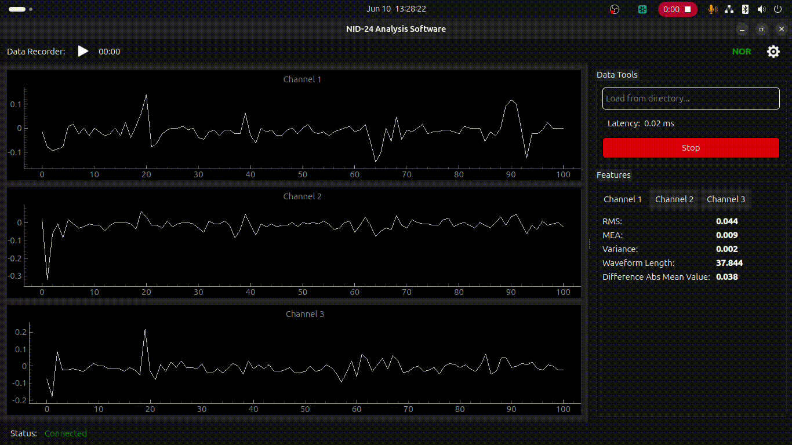

<p style="font-size: 14px; text-align: center; font-weight: 100;">Analysis Software</p>

Analysis software allows you to observe sEMG signals in real-time. You can create your own datasets using the utility provided. The software is based on modular components allowing you to modify codebase easily. This development pattern allows fault-tolerant system.

## Features

 - Visualise signals in real-time.
 - Create your own datasets.
 - Record observations.
 - Plug and Play software.
 - Modular and fault tolerant architecture.
 - Observe signal features change in real time.

## Supported Platforms 


## Development Stack

      


## Installation

Installation is simple and straightforward follow the steps below to install the application.

1. Clone the repository

```bash
git clone https://github.com/Raghav67816/NID-24.git
```

2. Enter into the cloned directory.

```bash
cd NID-24/
```

!!! info
    Please install Python3 before continuing.


3. Create a virtualenv and install requirements.

```bash
pip3 install virtualenv
virtualenv env
source env/bin/activate

pip3 install -r requirements.txt
```

4. Run application

```bash
sudo ./env/bin/python3 app.py
```

!!! info
    The application requires to interact with **rfcomm** utility of Linux system. Thus, root permissions must be provided in the way above.


## Troubleshooting

### 1. Controller Board cannot connect to PC

The application requires **rfcomm** utility to enable devices to connect. However, if you have **Bluez ≥ 5.4** this will not work because newer version of Bluez have dropped support for rfcomm. However, rfcomm is very stable and completely satisfies the requirements of analysis software.

To fix this, run bluetooth service in **compatibility mode**

 - Open the bluetooth service file (for systemd)

```bash
sudo nano /usr/lib/systemd/system/bluetooth.service
```

 - Locate the following line

```bash
[Service]
Type=dbus
BusName=org.bluez
ExecStart=/usr/libexec/bluetooth/bluetoothd # this one
NotifyAccess=main
#WatchdogSec=10
Restart=on-failure
CapabilityBoundingSet=CAP_NET_ADMIN CAP_NET_BIND_SERVICE
LimitNPROC=1
```

 - Add compatibility flag

```bash
[Service]
Type=dbus
BusName=org.bluez
ExecStart=/usr/libexec/bluetooth/bluetoothd --compat  # like this
NotifyAccess=main
#WatchdogSec=10
Restart=on-failure
CapabilityBoundingSet=CAP_NET_ADMIN CAP_NET_BIND_SERVICE
LimitNPROC=1
```

 - Restart bluetooth service and daemon

```bash
sudo systemctl restart bluetooth.service
sudo systemctl daemon-reload
```
