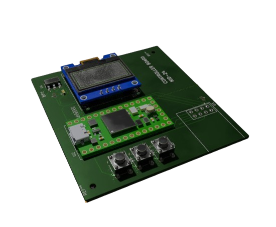

The Controller Board is respondsible for reporting status of the system i.e:

 - Connection status of MCU and Teensy 4.0
 - Connection of Teensy 4.0 and PC
 - Battery Level of both systems

Real life board differs from the above render in terms of appearance

!!! warning

    Few processes are pending. Once completed, firmware development will be started and this board will be discussed deeply.
