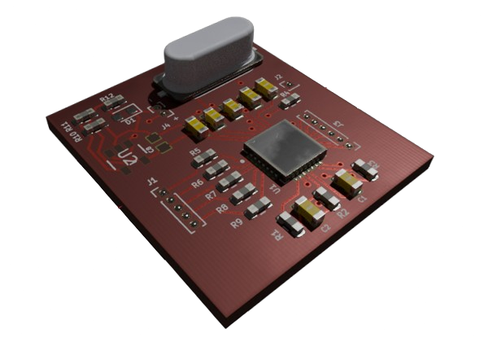

EasyEMG board is a custom ADS1293 based breakout board configured for 3-channel / 5 lead application. The design of this board strictly follows the guidelines of [datasheet](https://www.ti.com/lit/ds/symlink/ads1293.pdf?ts=1780662406410&ref_url=https%253A%252F%252Fwww.google.com%252F) provided by Texas Instruments.

This board is extremely compact a 20x20 mm board looks like a coin sized PCB. This allows us to develop this project into a consumable project.

EasyEMG Board Render. IRL images will shared soon

Features:

 - Super Compact Size (20mm x 20mm)
 - 24-bit ADC resolution
 - Configured for 3 channel / 5 Lead Application
 - Streams data at a frequency of 1 KHz*

The board is being assembled and tested. Actual images will shared soon.
For more information about design please refer to [Page 63](https://www.ti.com/lit/ds/symlink/ads1293.pdf?ts=1780662406410&ref_url=https%253A%252F%252Fwww.google.com%252F) of the datasheet.

PCB files are available here [here](https://github.com/Raghav67816/NID-24/tree/master/ads1293_board/iter2)

!!! warning "Improvements Pending"
    The EasyEMG board requires following improvements:

     - Use of correct LDO. (Currently uses a 5v LDO footprint due to human error)
     - Use of JST connectors instead of pin headers.

**FIRMWARE WILL BE DISCUSSED SOON**
