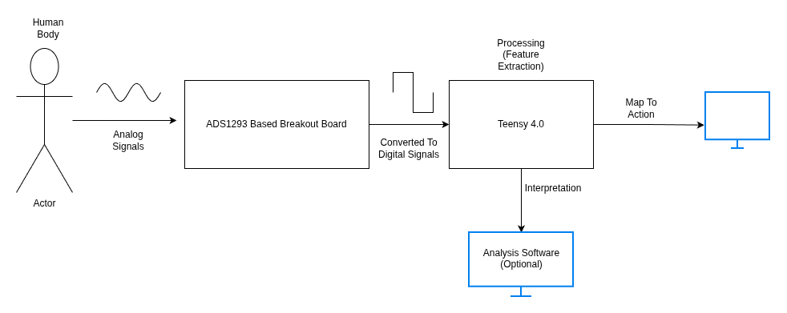

## Overview

Weclome to NID-24 project. We are building a muscle fatigue tolerant EMG system primary aimed to developing exciting **human-computer-interfaces**. Our goal is to build a stable pipeline for sEMG signals acquisition. The core pipeline will allow development of diverse applications with ease.

The project is divided into 3 main parts which can studied deeply in the upcoming sections.

 - Hardware: Includes custom ADS1293 based breakout board.
 - Software: Includes development tools.
 - CAD: Includes plans on reducing size of the system to turn this into a wearable and more accessible product.

## Features

 - Modular Software Systems
 - Easy To Get Started No Setup Required
 - Extensive Developer Tools
 - Coin Sized PCBs
 - 100% Open-Source

## General Architecture

A quick representation of general logic of the system

Electrodes are attached to the human body, ADS1293 receives these analog signals and converts them into digital signals. These digital signals are processed by Teensy 4.0, the board extracts required features and feeds it to the AI model for action mapping. The output is shared to the PC over bluetooth acting like a mouse.

!!! warning ""
    The inital aim of the project is aimed at the application of this system into a non-traditional mouse. However, in the curent phase pointer movement is not supported.

## Development Roadmap

Phase 1:

 - [x] Analysis Software Development (Stable)
 - [x] Modification of ECG Cable
 - [x] Verification of Power Rails In ADS1293 Breakout Board
 - [ ] Controller Board Firmware
 - [ ] ADS1293 Configuration
 - [ ] Dataset Preparation
 - [ ] Data Labeling
 - [ ] Model Training

Phase 2:

 - [ ] Development of Smaller MCU
 - [ ] Integration of IMU for 2D movement of mouse pointer
 - [ ] Fatigue tolerance
 - [ ] Wearable Design

## Contributing

Contributes are highly welcomed. If you want to get involved please open issues in the GitHub repos, or email me at [kumaraghav079@gmail.com](mailto:kumaraghav079@gmail.com)
